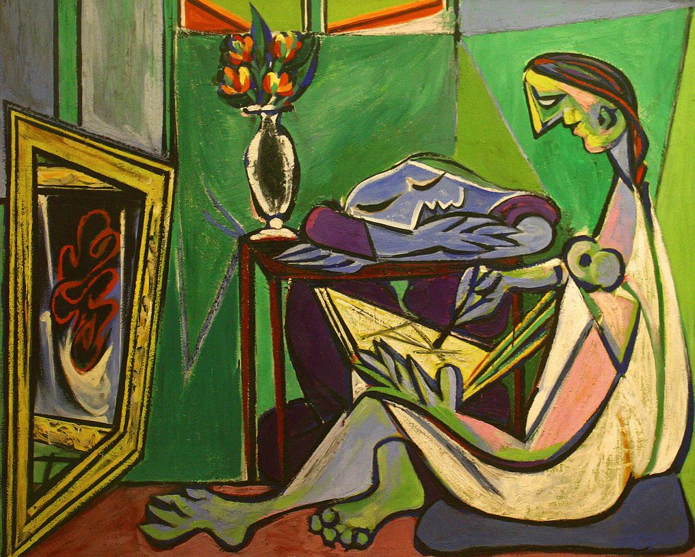

# Video Style Transfer

  
   

*Shrek styled with La Muse by Picasso*
## Group members
* [Tobias Andersen](https://github.com/multitalentloes)
* [Kjerand Evje](https://github.com/kjerand)
* [Dilawar Mahmood](https://github.com/dilawarm)
* [Håvard Markhus](https://github.com/Haavasma)

The unbalanced commit log is a result of us working over Google Colab and Visual Studio Live Share.

## What we have done
This report is the final delivery for our video style-transfer project for __TDAT3025 - Applied Machine Learning with Project__. Image style-transfer is trying to recreate an image as if it was made in the style of another reference image. Video style-transfer is image style-transfer taken a step further.  Styling an entire video with a single style image is not just the process of image style transfer repeated for each frame. Issues ranging from stability of output images to runtime occur and need to be addressed. 

The purpose of this project is to compare existing ways of implementing video style transfer and to implement our own versions based on these.
## Project
* [code/gatys](code/gatys) contains the implementation of [Gatys](https://arxiv.org/pdf/1508.06576.pdf) _et al_.
  * Here we style the video in a naive way, styling the video frame for frame and putting everything together at the end.
  * Example: https://youtu.be/OzwG4_BDelU
* [code/ruder](code/ruder) contains the implementation of [Ruder](https://arxiv.org/pdf/1604.08610.pdf) _et al_.
  * Here we style the video by introducing a temporal constraint. The idea is to penalize the model for large deviations between two adjacent frames. This is done by using DeepFlow, a flow detection algorithm.
  * Example: https://youtu.be/gAxoTpOQA6E
* [code/johnson](code/johnson) contains the implementation of [Johnson](https://arxiv.org/pdf/1603.08155.pdf) _et al_ combined with [Ulyanov](https://arxiv.org/pdf/1607.08022.pdf) _et al_
  * Here we train a neural network to learn how to style different images. This is much faster since we only have to do one forward-pass through the network to style each the frames.
  * We combined this algorithm with Instance normalization to speed up the optimization, and reduce noise.
  * Example: https://youtu.be/krjY1u1vZc4
* [code/huang](code/huang) contains the implementation of [Huang](https://arxiv.org/pdf/2007.13010v1.pdf) _et al_ combined with [Ruder](https://arxiv.org/pdf/1604.08610.pdf) _et al_
  * Here we define the style of an image as a distribution of features. Then we use the Wasserstein metric as a difference between the different distributions. This representation gives us a more visually pleasing result. The computation of the Wasserstein metric is computationally expensive, thus resulting in longer runtimes.
  * We combined this algorithm with a temporal constraint loss function so that the video becomes much more smoother.
  * Example: https://youtu.be/pujUa0c59hI
* We have also implemented color preservation for preserving the original color of the video, only applying the style. [Gatys](https://arxiv.org/pdf/1606.05897.pdf) _et al_
  * Example: https://youtu.be/5TZCByrMHJs

The end.
